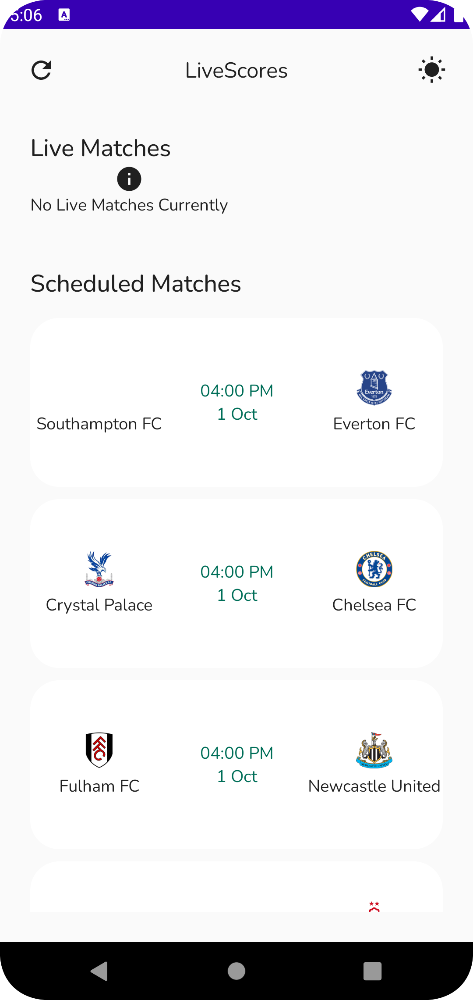

# NOTE ✋🚦[READ CAREFULLY!!]
If you coming from the tutorial its sad to say Elena API will be closing its operation on the 1st October. But good news 😊 the API integration will remain the same, just a change of the live-scores API.

The `main branch` contains the `Elena API` integration and the `fix/sport-data-api` branch contains the new `SportsData API` integration which has a free tier also

## LiveScoreApp
An Android App that fetches live and upcoming matches that used to fetch data from ElenaSport API but now SportsData API

## Prerequisite Before Running This App
Please sign up to [SportsDataApi](https://sportdataapi.com/) and get you API key from your Dashboard then navigate to `util/Constants.kt` and put
it in the variable;

``
const val API_KEY = "PUT API KEY HERE"
``

### ScreenShots
