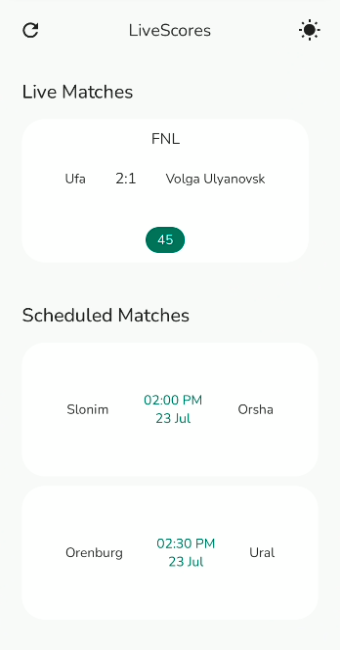

# NOTE ✋🚦
Elena API is closing soon so I resorted to using the SportsData API, the main branch contains the Elena API integration and the fix/sport-data-api branch contains the new API integration

## LiveScoreApp
An Android App that fetches live and upcoming matches that used to fetch data from ElenaSport API but now SportsData API

## Prerequisite Before Running This App
Please sign up to [SportsDataApi](https://sportdataapi.com/) and get you API key from your Dashboard then navigate to `util/Constants.kt` and put
it in the variable;

``
const val API_KEY = "PUT API KEY HERE"
``

### ScreenShots

### Demo
https://user-images.githubusercontent.com/72180010/180609394-38397849-0180-44f6-8ad4-ca69c1ca18d9.mp4